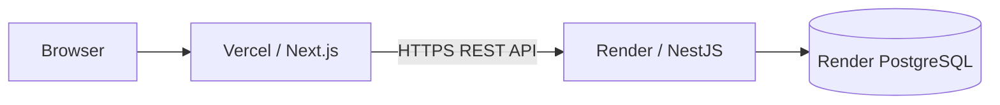

# Deploy Frontend to Vercel and Backend to Render

คู่มือนี้ใช้โครงสร้าง monorepo ปัจจุบัน:

- `frontend/` — Next.js สำหรับ Vercel
- `backend/` — NestJS/Prisma สำหรับ Render
- PostgreSQL — Render Postgres

ควร push repository ขึ้น GitHub, GitLab หรือ Bitbucket ก่อนเริ่ม และต้องรัน `npm run lint`, `npm test` และ `npm run build` ให้ผ่านในเครื่อง

## Deployment Architecture



## 1. Create PostgreSQL on Render

1. เข้า Render Dashboard แล้วเลือก **New > Postgres**
2. ตั้งชื่อ database เช่น `nextzy-rewards-db`
3. เลือก region เดียวกับ backend เพื่อลด latency
4. สร้าง database แล้วเปิดหน้า **Info/Connect**
5. เก็บค่า **Internal Database URL** ไว้ใช้เป็น `DATABASE_URL`

ใช้ Internal URL กับ Render backend เท่านั้น เพราะเชื่อมต่อผ่าน private network ของ Render อย่านำ URL หรือรหัสผ่าน database ไปใส่ใน Vercel

เอกสาร: [Render Postgres](https://render.com/docs/postgresql-creating-connecting)

## 2. Deploy Backend to Render

### Create the web service

1. เลือก **New > Web Service** และเชื่อม repository
2. ตั้งค่า runtime เป็น **Node**
3. แนะนำให้เลือก region เดียวกับ PostgreSQL
4. ปล่อย **Root Directory** ว่าง เพื่อให้ใช้ root `package-lock.json` และ npm workspaces
5. ตั้งค่า commands ดังนี้:

| Setting | Value |
| --- | --- |
| Build Command | `npm ci && npm run db:generate && npm run build -w @nextzy/api` |
| Start Command | `npx prisma migrate deploy --schema backend/prisma/schema.prisma && npm run start -w @nextzy/api` |
| Health Check Path | `/health` |

Render กำหนด `PORT` ให้อัตโนมัติ ไม่ต้องสร้างตัวแปรนี้เอง ตัว API bind กับ `0.0.0.0` และอ่านค่า `PORT` รองรับ Render แล้ว

### Backend environment variables

เพิ่มตัวแปรในหน้า **Environment**:

| Name | Value |
| --- | --- |
| `DATABASE_URL` | Internal Database URL จาก Render Postgres |
| `WEB_ORIGIN` | URL ของ Vercel เช่น `https://nextzy-rewards.vercel.app` |
| `NODE_ENV` | `production` |

หากยังไม่ทราบ Vercel URL ให้ใส่ URL ที่คาดว่าจะใช้ก่อน แล้วกลับมาแก้ `WEB_ORIGIN` หลัง deploy frontend จากนั้น redeploy/restart backend

### Verify the backend

หลัง deploy สำเร็จ สมมติ Render URL คือ `https://nextzy-api.onrender.com`:

```text
https://nextzy-api.onrender.com/health
https://nextzy-api.onrender.com/docs
```

`/health` ต้องตอบ `{"status":"ok"}` ส่วน `/docs` ต้องเปิด Swagger UI ได้ การรัน `prisma migrate deploy` ใน Start Command จะ apply เฉพาะ migration ที่ commit อยู่ใน `backend/prisma/migrations/`

เอกสาร: [Render Node services](https://render.com/docs/deploy-node-express-app), [Render monorepos](https://render.com/docs/monorepo-support), [Render health checks](https://render.com/docs/health-checks), [Prisma production migrations](https://www.prisma.io/docs/orm/prisma-client/deployment/deploy-database-changes-with-prisma-migrate)

## 3. Deploy Frontend to Vercel

1. เข้า Vercel Dashboard แล้วเลือก **Add New > Project**
2. Import repository เดียวกัน
3. ตั้ง **Root Directory** เป็น `frontend`
4. Framework Preset ควรตรวจพบเป็น **Next.js**
5. ใช้ค่าตั้งต้นดังนี้:

| Setting | Value |
| --- | --- |
| Install Command | `npm install` |
| Build Command | `npm run build` |
| Output Directory | ค่าเริ่มต้นของ Next.js (`.next`) |

### Frontend environment variable

เพิ่มตัวแปรใน **Project Settings > Environment Variables**:

| Name | Value | Environments |
| --- | --- | --- |
| `NEXT_PUBLIC_API_URL` | Render backend URL เช่น `https://nextzy-api.onrender.com` | Production, Preview, Development |

ห้ามเติม `/` ท้าย URL ตัวอย่างที่ถูกต้องคือ `https://nextzy-api.onrender.com` ค่า `NEXT_PUBLIC_*` ถูกฝังลง client bundle ตอน build ดังนั้นหลังเปลี่ยนค่าต้อง **Redeploy** frontend

เอกสาร: [Vercel monorepos](https://vercel.com/docs/monorepos), [Vercel environment variables](https://vercel.com/docs/environment-variables)

## 4. Finalize CORS

หลัง Vercel deploy เสร็จ ให้คัดลอก production domain ที่แสดงใน Vercel เช่น:

```text
https://nextzy-rewards.vercel.app
```

กลับไป Render แล้วตั้ง `WEB_ORIGIN` ให้ตรงกับ URL นี้ทุกตัวอักษร โดยไม่เติม `/` ท้าย URL จากนั้น restart/redeploy backend

Preview deployments ของ Vercel ใช้ hostname ต่างจาก production และจะถูก CORS ปฏิเสธตามค่าเริ่มต้น ให้ทดสอบ end-to-end บน production domain หรือเปลี่ยน `WEB_ORIGIN` เป็น preview URL ชั่วคราว ไม่ควรเปิด CORS เป็น `*` สำหรับ production

## 5. End-to-End Verification

เปิด Vercel URL แล้วตรวจสอบตามลำดับ:

1. หน้า Home โหลดคะแนนเริ่มต้นและไม่มี CORS error
2. กด **ไปเล่นเกม** และ **สุ่มคะแนน**
3. ปิด modal แล้วกลับหน้า Home คะแนนและ play history ต้องถูกบันทึก
4. ทดสอบรับรางวัลเมื่อถึง checkpoint และตรวจว่ารับซ้ำไม่ได้
5. กด Reset แล้วตรวจว่าคะแนนและประวัติถูกล้าง
6. เปิด Render `/docs` และทดสอบ API ผ่าน Swagger

หาก frontend แสดงข้อความเชื่อมต่อไม่สำเร็จ ให้ตรวจ `NEXT_PUBLIC_API_URL`, `WEB_ORIGIN`, Render service logs และ browser Network tab ก่อน

## Updating the Application

- Push commit ใหม่: Vercel และ Render จะ deploy จาก branch ที่เชื่อมไว้โดยอัตโนมัติ
- เปลี่ยน Prisma schema: สร้าง migration ในเครื่องด้วย `npm run db:migrate`, commit migration แล้ว push ห้ามใช้ `prisma migrate dev` บน production
- เปลี่ยน `NEXT_PUBLIC_API_URL`: redeploy Vercel เพื่อสร้าง client bundle ใหม่
- เปลี่ยน backend environment variables: restart/redeploy Render service

## Custom Domains

เมื่อเพิ่ม custom domains ให้ตั้งค่าทั้งสองฝั่งใหม่:

- Vercel frontend: `https://rewards.example.com`
- Render backend: `https://api.rewards.example.com`
- Vercel `NEXT_PUBLIC_API_URL=https://api.rewards.example.com`
- Render `WEB_ORIGIN=https://rewards.example.com`

จากนั้น redeploy ทั้ง frontend และ backend และตรวจ `/health` กับ flow การเล่นเกมอีกครั้ง
