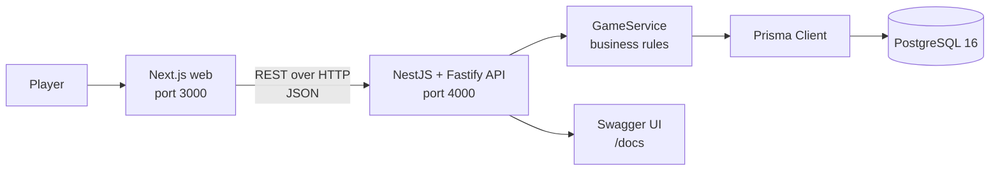
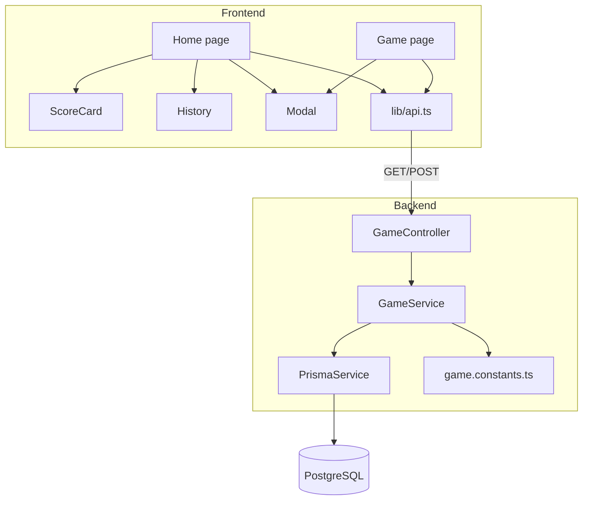
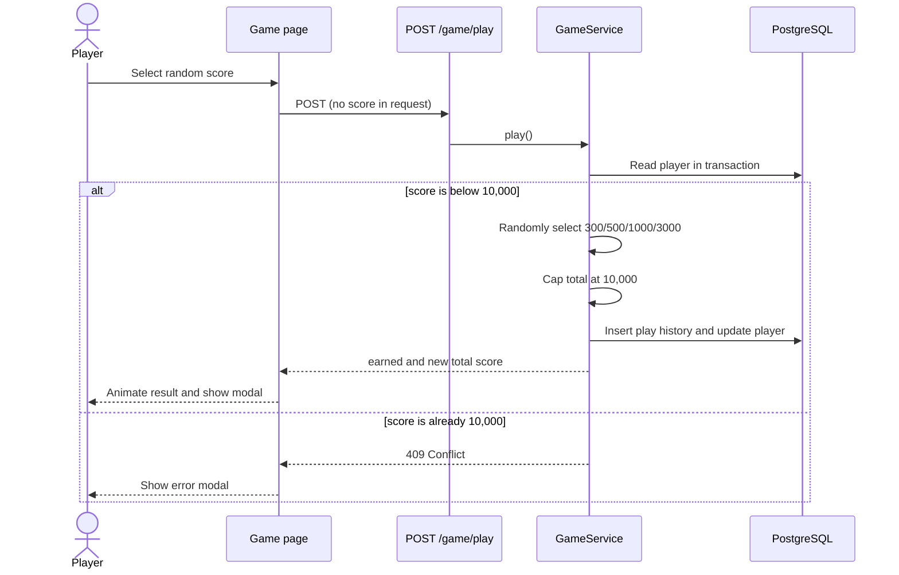
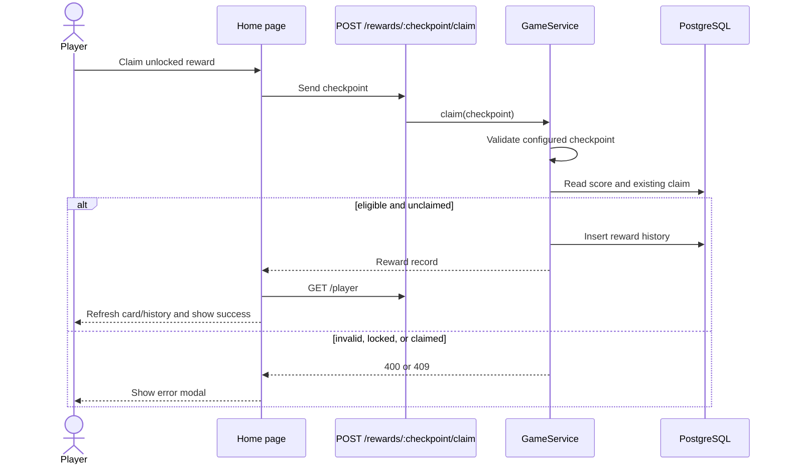
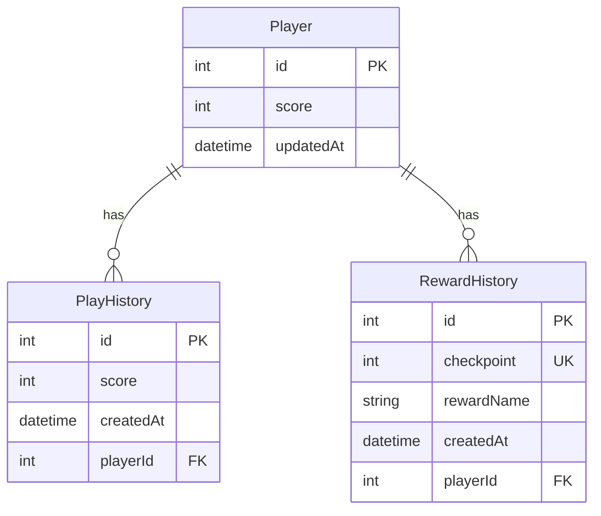

# System Architecture

## Context

Nextzy Rewards is a mobile-first, single-player reward game. The browser renders the game and sends user intentions; the API owns score generation, caps, reward eligibility, one-time claims, and persistence.

## Container responsibilities

| Boundary         | Owns                                                                                        | Must not own                                                             |
| ---------------- | ------------------------------------------------------------------------------------------- | ------------------------------------------------------------------------ |
| Next.js frontend | Rendering, local interaction state, animation, navigation, API error presentation           | Choosing earned score, changing totals directly, approving reward claims |
| NestJS API       | Validation, random score selection, score cap, reward rules, transactions, response shaping | Browser presentation state                                               |
| PostgreSQL       | Durable player, play history, and reward history records; uniqueness constraints            | Business decisions outside constraints                                   |

## Runtime component diagram

## Primary workflows

### Play a round

The history records the selected `earned` value even when only part of it fits below the cap. For example, a total of 9,800 plus an earned value of 500 produces a total of 10,000 and a history entry of 500.

### Claim a reward

## Data model

## Current constraints and extension points

- The application uses the fixed player ID `1`; there is no authentication or multi-user isolation.
- Reward checkpoint uniqueness is global, which is correct only while one player exists. Multi-player support requires a compound unique key on `(playerId, checkpoint)`.
- The frontend and backend each define score and reward constants. The API is authoritative. Contract tests or generated shared types should replace duplication if the rules change frequently.
- API calls have no retry, timeout, or request correlation ID. Add these before treating the service as production-critical.
- Reset is intentionally destructive and unauthenticated for tester convenience.
