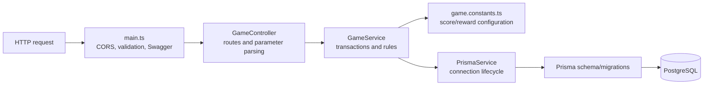

# Backend Guide

## Purpose and boundaries

`backend/` is a NestJS 11 REST service running on Fastify with Prisma and PostgreSQL. It is authoritative for all game rules and persisted state. The current model intentionally represents one anonymous player with ID `1`.

## Layer map



## Business rules

| Rule                                              | Enforcement                                                     |
| ------------------------------------------------- | --------------------------------------------------------------- |
| Score choices are 300, 500, 1,000, or 3,000       | `game.constants.ts`; selected server-side in `GameService.play` |
| Total score cannot exceed 10,000                  | `cappedScore` inside the play transaction                       |
| No play after reaching 10,000                     | `409 Conflict` from `GameService.play`                          |
| Checkpoints are 5,000/A, 7,500/B, and 10,000/C    | `REWARDS` lookup                                                |
| Only configured checkpoints can be claimed        | `400 Bad Request` before transaction                            |
| Score must reach the checkpoint                   | `400 Bad Request` inside claim transaction                      |
| Each checkpoint can be claimed once               | Service check plus unique database constraint                   |
| Reset clears score and both histories             | One Prisma transaction                                          |
| A player always exists before state mutation/read | Upsert of fixed `PLAYER_ID`                                     |

## Transaction boundaries

- `play`: reads the current score, selects and records the earned value, and updates the total atomically.
- `claim`: checks the score and prior claim, then inserts reward history atomically. The database unique constraint is the final concurrency guard.
- `reset`: deletes both history sets and sets score to zero atomically.

## File structure

```text
backend/
├── prisma/
│   ├── migrations/
│   │   ├── 20260619000000_init/
│   │   │   └── migration.sql # Initial PostgreSQL DDL
│   │   └── migration_lock.toml
│   └── schema.prisma          # ORM models and datasource
├── src/
│   ├── app.module.ts          # Root dependency graph and config loading
│   ├── game.constants.spec.ts # Unit coverage for cap/max helpers
│   ├── game.constants.ts      # Authoritative game configuration/helpers
│   ├── game.controller.ts     # REST routes and Swagger summaries
│   ├── game.service.ts        # Business operations and transactions
│   ├── main.ts                # Fastify bootstrap, CORS, pipes, Swagger
│   └── prisma.service.ts      # Prisma connection lifecycle
├── .env.example               # Local database/API/CORS example
├── Dockerfile
├── jest.config.js
├── nest-cli.json
├── package.json
├── tsconfig.build.json
└── tsconfig.json
```

## Database ownership

- Change `schema.prisma` first, then create a named migration with `npm run db:migrate` during development.
- Commit both schema and generated migration.
- Never edit an already deployed migration; add a corrective migration.
- API code should access the database through `PrismaService` from a service, not from controllers.
- Use a transaction when one user action writes multiple records or combines eligibility checks with writes.

## Environment variables

| Variable       | Required            | Default                 | Meaning                                |
| -------------- | ------------------- | ----------------------- | -------------------------------------- |
| `DATABASE_URL` | Yes                 | None                    | PostgreSQL Prisma connection URL       |
| `PORT`         | Production platform | None                    | Preferred listening port when provided |
| `API_PORT`     | No                  | `4000`                  | Local listening port fallback          |
| `WEB_ORIGIN`   | No                  | `http://localhost:3000` | Exact browser origin permitted by CORS |

## Adding an endpoint

1. Define the HTTP operation in `game.controller.ts` or a new domain controller.
2. Use DTO classes with validation decorators for request bodies; global whitelist/transform is already enabled.
3. Put decisions and persistence in a service, with explicit transaction boundaries.
4. Add Swagger decorators and update `docs/api/openapi.yaml` in the same change.
5. Add service/unit tests and API integration tests for success, validation, and conflict paths.
6. If persistence changes, add a Prisma migration and call it out in the pull request.

## Backend verification checklist

- Client input cannot select an earned score or set reward state.
- Error status distinguishes invalid input (`400`) from state conflict (`409`).
- Concurrency cannot create duplicate claims or partially update a round.
- Response fields still match the OpenAPI contract.
- `npm run lint -w @nextzy/api`, tests, migration checks, and production build pass.
