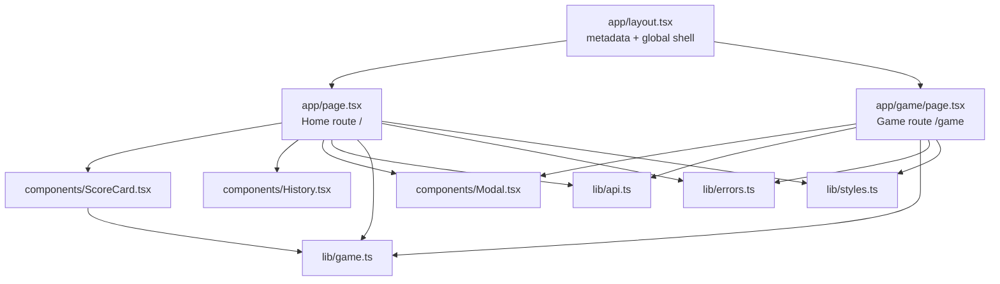

# Frontend Guide

## Purpose and boundaries

`frontend/` is a Next.js 15 App Router client using React 19, TypeScript, and Tailwind CSS. Both product routes are client components because they fetch browser-side state and manage interaction/animation. The frontend never submits an earned score or a new total; it asks the API to play, claim, or reset.

## Component map



## Routes and state ownership

| Route/component               | Responsibility                                                           | Important state/props                            |
| ----------------------------- | ------------------------------------------------------------------------ | ------------------------------------------------ |
| `/` (`app/page.tsx`)          | Load full player state; coordinate claim/reset; choose history tab       | `player`, `tab`, `busy`, `dialog`                |
| `/game` (`app/game/page.tsx`) | Load current score; request play; animate elimination; allow repeat play | `totalScore`, `visibleScores`, `phase`, `dialog` |
| `ScoreCard`                   | Render total, progress, checkpoints, and claim button states             | `score`, claimed checkpoints, `busy`, `onClaim`  |
| `History`                     | Switch and render play/reward history                                    | selected tab and both history collections        |
| `Modal`                       | Present success and API errors                                           | title, detail, optional icon, close callback     |

`Home` refreshes the complete player state after a successful claim or reset. `GamePage` updates only its local total after a play; returning Home causes a fresh `GET /player` because the route mounts again.

## API integration

`lib/api.ts` is the only HTTP boundary. Add new endpoint methods and their explicit response types there instead of calling `fetch` directly from components.

- Base URL: `NEXT_PUBLIC_API_URL`, falling back to `http://localhost:4000`.
- Non-2xx responses: first NestJS `message` value becomes a JavaScript `Error`.
- State requests use `cache: 'no-store'`.
- Mutation requests currently send no body.

The public contract is documented in [`api/openapi.yaml`](api/openapi.yaml).

## File structure

```text
frontend/
├── app/
│   ├── game/
│   │   └── page.tsx          # Game route and elimination animation
│   ├── globals.css           # Tailwind layers and global animation/safe-area rules
│   ├── layout.tsx            # Thai root document and metadata
│   └── page.tsx              # Home route and top-level state orchestration
├── components/
│   ├── History.tsx           # Play/reward tab and rows
│   ├── Modal.tsx             # Shared feedback dialog
│   └── ScoreCard.tsx         # Progress and reward claims
├── lib/
│   ├── api.ts                # Typed HTTP client and API response types
│   ├── errors.ts             # Unknown-to-display-message conversion
│   ├── game.ts               # UI copies of score/checkpoint rules
│   └── styles.ts             # Shared Tailwind class strings
├── .env.local.example        # Public API URL example
├── Dockerfile                # Production image
├── next.config.ts
├── package.json
├── postcss.config.js
├── tailwind.config.ts
└── tsconfig.json
```

## Adding frontend behavior

1. Define or update the API type and method in `lib/api.ts`.
2. Keep route components responsible for async orchestration and reusable components driven by props.
3. Put cross-route domain helpers in `lib/`; do not reproduce cap or checkpoint logic in multiple components.
4. Show recoverable errors through `Modal` using `getErrorMessage`.
5. Add `*.test.tsx` beside the component or under `frontend/tests/`.
6. Verify mobile widths down to the supported 300 px shell and tablet behavior.

## Frontend verification checklist

- Initial loading and API failure states are visible.
- Buttons cannot start duplicate mutations while `busy` or a round is active.
- Keyboard and screen-reader semantics remain valid (`button`, dialog role, tabs, labels).
- Score formatting, cap state, and all three checkpoint button states are covered.
- Closing the game result restores all score options and allows another round.
- `npm run lint -w @nextzy/web`, tests, and production build pass.
