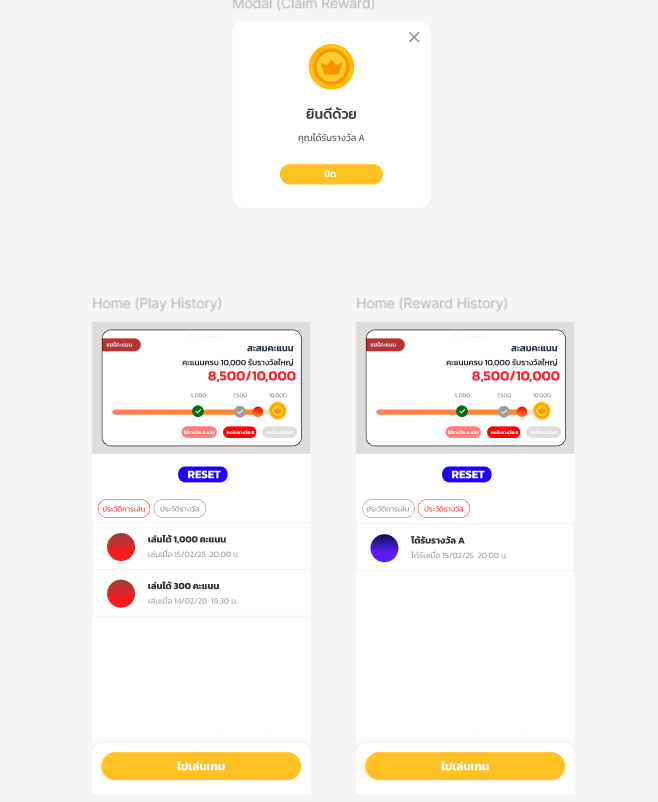
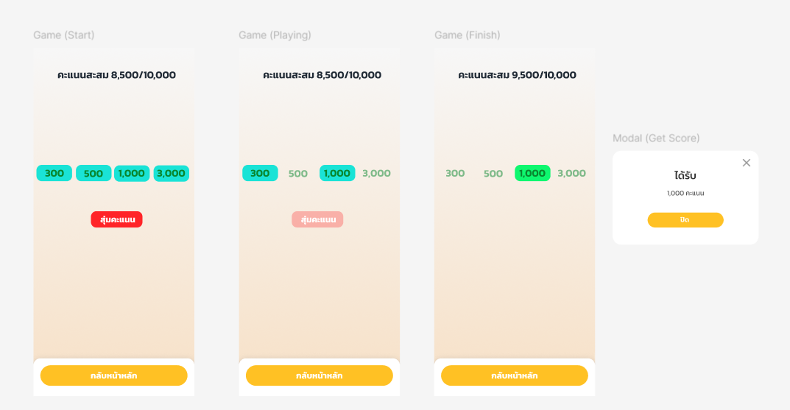

Tests #3: Fullstack Engineer Candidate (Junior)
ยินดีต้อนรับสู่การทดสอบทักษะการพัฒนา Web Application สำหรับตำแหน่ง Fullstack Engineer ที่ Nextzy โดยโจทย์นี้จะให้คุณพัฒนาเว็บแอปพลิเคชันสำหรับการเล่นเกมเพื่อรับรางวัล
🎯 Project Overview
Project name: เกมสะสมคะแนน Nextzy
สร้างแอพพลิเคชันโดยใช้ NextJs และ NestJs หรือ GoLang ที่มีฟีเจอร์ดังนี้:
📱 Requirement features

1. Home page

- Front-end
  - พัฒนาด้วย Next.js
  - ใช้ Tailwind CSS เป็น UI framework หลัก
  - รองรับการแสดงผลแบบ Responsive design
    - Tablet/Mobile
  - ติดต่อกับ Backend API ที่พัฒนาขึ้นเอง
- Back-end
  - พัฒนาด้วย NestJS หรือ GoLang
  - จัดการ Business Logic และ Data Transformation
  - ใช้ Database เป็น PostgreSQL (Prisma / TypeORM / Gorm)

2. API Documentation

- มีลิงค์ให้สามารถเข้าไปดู API ที่ออกแบบ และสามารถยิงทดสอบได้จริง
- แนะนำ: https://apidog.com/

หมายเหตุ: รายละเอียดการออกแบบ UI สามารถดูได้ที่
https://www.figma.com/design/yqeNaCePL7u6u9jPFgs6N0

---

Requirement
1.ภาพรวมของเว็บแอป (Overview)
เกมสะสมคะแนน (Gamification Web App)
ผู้เล่นสามารถ:

- เข้ามาเล่นเกม "สุ่มเก็บคะแนนเพื่อรับรางวัล"
- รับคะแนนสะสมจากการเล่นเกม
- นำคะแนนไปปลดล็อกรางวัลตาม checkpoint
- ดูประวัติการเล่น และประวัติการได้รับรางวัล
  2.หน้า Home
- โชว์ "คะแนนสะสม" และ "ระดับการได้รางวัล" ของผู้เล่น
- คะแนนสะสมเริ่มต้นที่ 0 และมีค่าสูงสุดที่ 10000
- "ระดับการได้รางวัล" มีทั้งหมด 3 checkpoint คือ "ครบ 5000", "ครบ 7500", "ครบ 10000"
- มี progress bar โชว์ว่าคะแนนสะสมตอนนี้ถึงระยะไหนแล้ว
- เมื่อคะแนนสะสมถึงหรือเกิน checkpoint ใด ผู้เล่นสามารถกดปุ่มเพื่อรับรางวัลของ checkpoint นั้นได้
- เมื่อกดรับรางวัล ระบบจะแสดง modal แจ้งว่ารับรางวัลสำเร็จ และไม่สามารถกดรับรางวัล checkpoint เดิมซ้ำได้อีก
- คะแนนสะสมจะได้มาจากการเข้าเล่นในหน้าเล่นเกม โดยกดปุ่ม "ไปเล่นเกม"
- มีปุ่ม reset เพื่อให้ tester สามารถรีเซตข้อมูลการสะสมคะแนน เพื่อที่จะทำการเทสใหม่อีกครั้งได้
- ส่วนประวัติการเล่นมีทั้งหมด 2 tab คือ "ประวัติการเล่น" และ "ประวัติรางวัล"
- "ประวัติการเล่น" จะแสดงประวัติการเล่น เช่น ได้คะแนน "300", "500", "1000", "3000"
- "ประวัติรางวัล" จะแสดงข้อมูลรางวัลทั้งหมดที่ผู้เล่นเคยได้รับ เช่น ได้ "รางวัล A", "รางวัล B", "รางวัล C"
  3.หน้า Game
- เกมจะโชว์คะแนนทั้งหมด คือ "300", "500", "1000", “3000”
- เมื่อกดปุ่ม "สุ่มคะแนน" คะแนนจะค่อยๆสุ่มหายไปทีละตัว จนสุดท้ายเหลือแค่คะแนนที่ผู้เล่นจะได้รับ
- เมื่อเกมจบแล้ว โชว์ modal ว่าได้รับคะแนนเท่าไหร่
- นำคะแนนที่ได้รับจากการเล่นเกมไปบวกเป็นคะแนนสะสม
- เวลากดปิด modal ไปแล้ว ให้ผู้เล่นยังอยู่ที่หน้านี้ และสามารถเล่นเกมเพื่อรับคะแนนสะสมต่อได้เลย (เล่นกี่ครั้งก็ได้)
- เมื่อกดปุ่ม "กลับหน้าหลัก" ให้กลับไปหน้า Home

